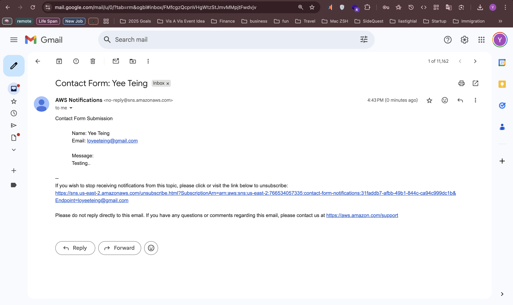

# Personal Portfolio Website

This repository contains multiple versions of my personal portfolio website.

## 🌐 Old Version
- The **oldVersion** branch contains a static website built and hosted with **GitHub Pages**.
- I configured GitHub Actions so that the site only updates when I deploy to the `oldVersion` branch.
- This version is what powers: [https://yeeteing.github.io/](https://yeeteing.github.io/).


## 🚀 Recent Version
- The **aws-master** branch hosts my **current portfolio** website using **AWS Amplify**.
- Amplify is set up for automated deployments whenever I push changes to `aws-master`.


### 🛠️ Tech & Tools
- **Frontend:** Built with **React.js**.  
- **Design Workflow:** Drafted the initial page with **Figma** and **Builder.io AI**, then customized it further based on my own vision.  
- **Media Hosting:** Images, videos and other files are stored in an **AWS S3 bucket**.  

- **Contact Form:**  
  - The portfolio includes a contact form so visitors can reach me directly.  
  - When the form is submitted:
    1. The request is sent to my **AWS Lambda Function URL** (HTTPS endpoint).  
    2. The Lambda executes with an **IAM role** that allows it to publish messages to **SNS**.  
    3. SNS then sends me an email notification with the visitor’s message.  

  - **Security:**  
    - The **Lambda Function URL** is configured with **CORS rules** so only my portfolio domain can make requests.  
    - Only **POST requests** are accepted; all other methods are blocked.  
    - The Lambda runs with least-privilege **IAM permissions** (only `sns:Publish` access).  
---
# Amplify Sandbox Setup

The **aws-master** project uses [AWS Amplify](https://docs.amplify.aws/) for backend resources.  
You can run a **temporary sandbox environment** locally using the Amplify CLI.

---

## 1. Install Dependencies

Make sure you have Node.js 18+ installed, then install Amplify:

```
npm install -g @aws-amplify/cli
```
Or just use npx:
```
npx ampx --version
```
From the project root, run:
```

npx ampx sandbox
```

This will:

Spin up a temporary Amplify backend in the cloud

Generate a local amplify_outputs.json file

Keep it updated while the sandbox is running